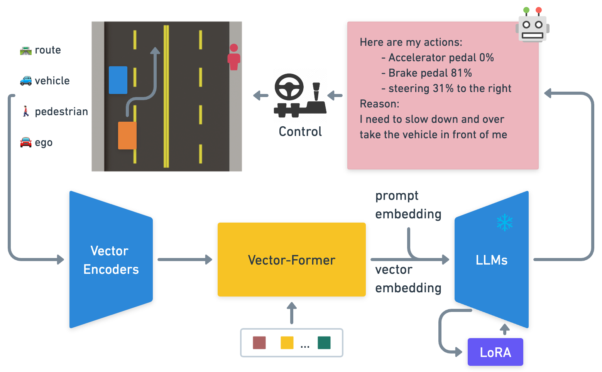

# 🚗Driving-with-LLMs🚗
This is the PyTorch implementation for inference and training of the LLM-Driver 
described in:

> **Driving with LLMs: Fusing Object-Level Vector Modality for Explainable Autonomous Driving**
>
>[Long Chen](https://www.linkedin.com/in/long-chen-in/), [Oleg Sinavski](https://uk.linkedin.com/in/oleg-sinavski), [Jan Hünermann](https://uk.linkedin.com/in/janhuenermann), [Alice Karnsund](https://uk.linkedin.com/in/alice-karnsund), [Andrew James Willmott](https://uk.linkedin.com/in/andrew-willmott-2ba18510), [Danny Birch](https://uk.linkedin.com/in/dannybirch), [Daniel Maund](https://uk.linkedin.com/in/danmaund), [Jamie Shotton](https://jamie.shotton.org/)
>
>[[preprint]](assets/preprint.pdf) [[arxiv]](https://arxiv.org/abs/2310.01957)

<p align="center">
     
     <br/> The LLM-Driver utilises object-level vector input from our driving simulator to predict explanable actions using pretrained Language Models, providing a robust and interpretable solution for autonomous driving. 
     
    <br/> The LLM-Driver running in open-loop prediction using the vector inputs (top-left BEV view), with the results of action prediction (steering angles and acceleration/brake pedals), action justification (captions on the rendered video), Driving Question Answering (table at the bottom).
</p>

## Getting Started
### Prerequisites
- Python 3.x
- pip
- Minimum of 20GB VRAM for running evaluations
- Minimum of 40GB VRAM for training (default setting)

### ⚙ Setup
1. **Set up a virtual environment**  

    ```sh
    python3 -m venv env
    source env/bin/activate
    ```

2. **Install required dependencies**  

    ```sh
    pip install -r requirements.txt
    ```

3. **Set up WandB API key**  

    Set up your [WandB](https://wandb.ai/) API key for training and evaluation logging.

    ```sh
    export WANDB_API_KEY=xxxxxxxxxxxxxxxxxxxxxxxxxxxxxxx
    ```
    
### 💿 Dataset
- **Training/testing data**:
The datasets have already been checked into the codebase. To unarchive them, use the following commands:
    ```
    tar -xzvf data/vqa_train_10k.tar.gz -C data/
    tar -xzvf data/vqa_test_1k.tar.gz -C data/
    ```

- **Re-collect DrivingQA data**:
While the training and evaluation datasets already include pre-collected DrivingQA data, we also offer a script that illustrates how to collect DrivingQA data using the OpenAI ChatGPT API. If you wish to re-collect the DrivingQA data, simplely run the following command with your OpenAI API key:
    ```sh
    python scripts/collect_vqa.py -i data/vqa_test_1k.pkl -o output_folder/ --openai_api xxxxxxxx
    ```
### 🏄 Evaluation

1. **Evaluate for Perception and Action Prediction**

    Run the following command:

    ```sh
    python train.py \
        --mode eval \
        --resume_from_checkpoint models/weights/stage2_with_pretrained/ \
        --data_path data/vqa_train_10k.pkl \
        --val_data_path data/vqa_test_1k.pkl \
        --eval_items caption,action \
        --vqa
    ```

2. **Evaluate for DrivingQA**

    Run the following command:

    ```sh
    python train.py \
        --mode eval \
        --resume_from_checkpoint models/weights/stage2_with_pretrained/ \
        --data_path data/vqa_train_10k.pkl \
        --val_data_path data/vqa_test_1k.pkl \
        --eval_items vqa \
        --vqa
    ```

3. **View Results**  

    The results can be viewed on the WandB project "llm-driver".

4. **Grade DrivingQA Results with GPT API**  

    To grade the results with GPT API, run the following command:
    ```sh
    python scripts/grade_vqa.py \
        -i data/vqa_test_1k.pkl \
        -o results/10k_ft.pkl \
        -r results/10k_ft.json \
        --openai_api xxxxxxxx
    ```
    Replace the `results/10k_ft.json` with the `val_results.table.json` downloaded from WandB to grade your results.
### 🏊 Training

1. **Run LLM-Driver Training**

    Execute the following command to start training:

    ```sh
    python train.py \
        --mode train \
        --eval_steps 50 \
        --val_set_size 32 \
        --num_epochs 5 \
        --resume_from_checkpoint models/weights/stage1_pretrained_model/ \
        --data_path data/vqa_train_10k.pkl \
        --val_data_path data/vqa_test_1k.pkl \
        --vqa
    ```
2. **Follow the previous section for evaluating LLM-Driver**

3. **[optional] Train and evaluate Perceiver-BC**

    Execute the following command to start training and evaluation:

    ```sh
    python train_bc.py \
        --num_epochs 25 \
        --data_path data/vqa_train_10k.pkl \
        --val_data_path data/vqa_test_1k.pkl
    ```

### 📝 Citation

If you find our work useful in your research, please consider citing:

```bibtex
@article{chen2023drivingwithllms,
  title={Driving with LLMs: Fusing Object-Level Vector Modality for Explainable Autonomous Driving},
  author={Long Chen and Oleg Sinavski and Jan Hünermann and Alice Karnsund and Andrew James Willmott and Danny Birch and Daniel Maund and Jamie Shotton},
  journal={arXiv preprint arXiv:2310.01957},
  year={2023}
}
```

### 🙌 Acknowledgements

This project has drawn inspiration from the [Alpaca LoRA](https://github.com/tloen/alpaca-lora) repository. We would like to express our appreciation for their contributions to the open-source community.
